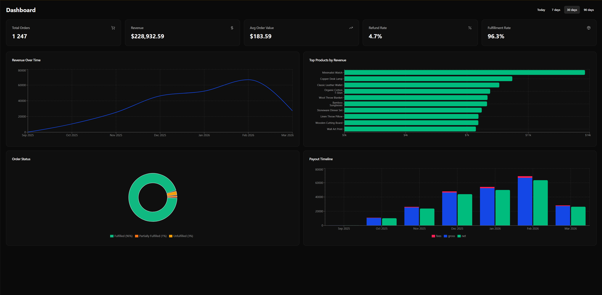
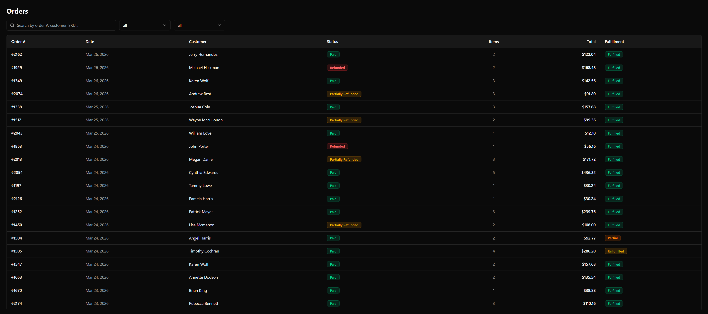
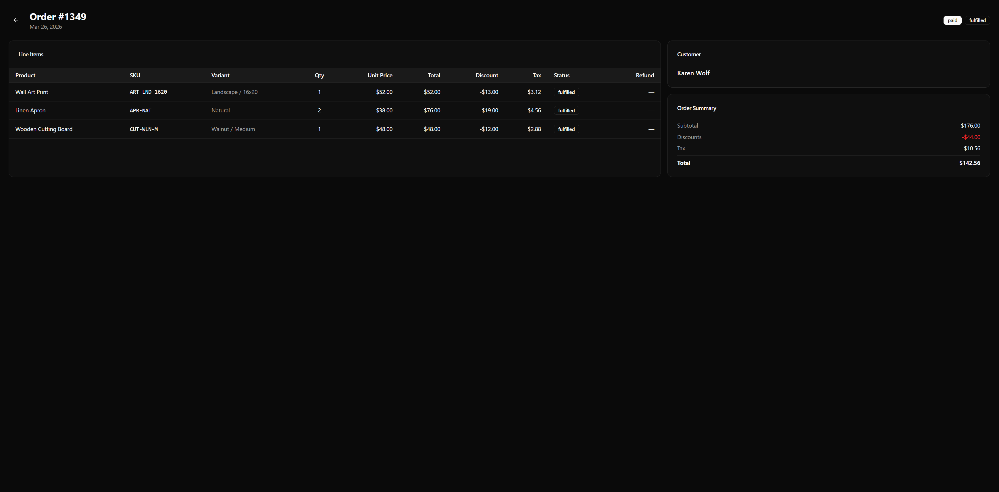
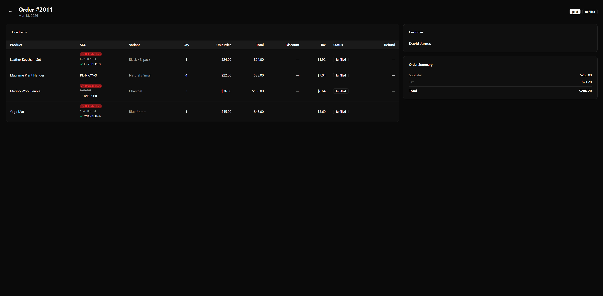
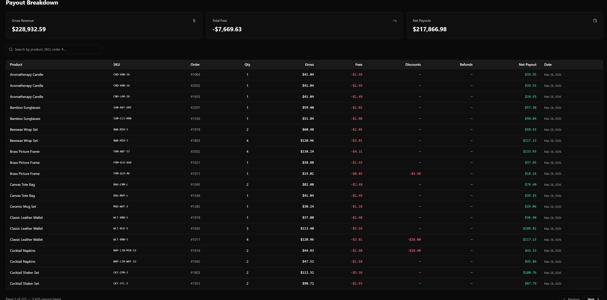
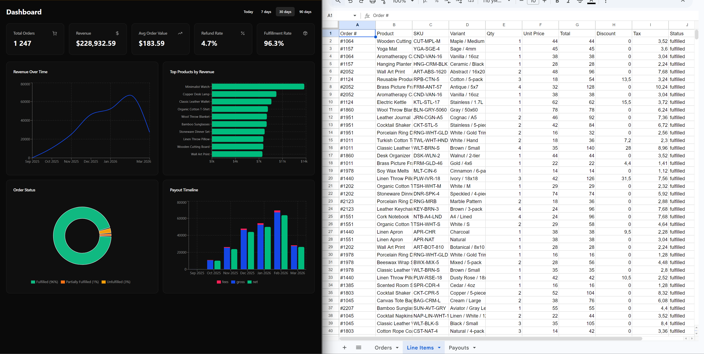
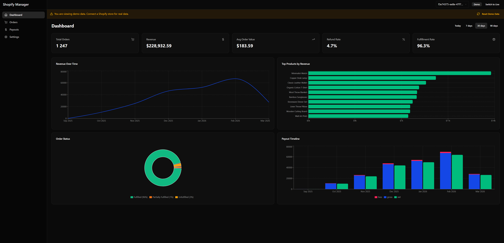
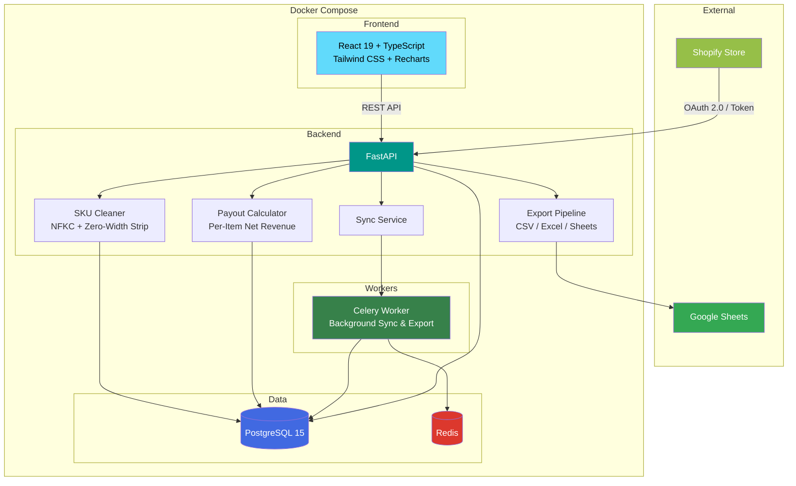

<h1 align="center">Shopify Order Manager</h1>
<p align="center"><strong>Stop losing track of your Shopify payouts.</strong></p>

<p align="center">
  
  
  
  
  
  
  
  
</p>

---

## The Problem

Shopify sellers face three persistent pain points that the admin panel doesn't solve:

**1. Per-item payout invisibility.** Shopify shows total order payouts, but sellers can't see how much they actually received for each individual product after fees, discounts, taxes, and refunds. Accountants need product-level numbers. Shopify doesn't provide them.

**2. Hidden Unicode characters break SKU matching.** When sellers copy SKUs from Shopify into spreadsheets, invisible zero-width characters (`U+200B`, `U+200D`, `U+00AD`) silently tag along. The result: VLOOKUP failures, inventory sync errors, and hours of debugging something you can't even see.

**3. Manual Google Sheets export.** Sellers spend 5-10 hours per week copying order data into spreadsheets for accounting, tax filing, or inventory reconciliation. Every sync is manual, error-prone, and creates duplicates.

**Shopify Order Manager** automates all three. Connect your store, and the system handles the rest.

---

## Key Features

- **Per-Item Payout Tracking** - See exact net revenue for every product: `revenue - Shopify fees - discounts - refunds = net payout`. Not just order-level — product-level.

- **SKU Cleaning Pipeline** - Automatically detects and strips hidden Unicode characters from SKUs using NFKC normalization + zero-width character removal. Shows before/after comparison with detailed badges.

- **Auto Google Sheets Sync** - One-click export to three organized sheets (Orders, Line Items, Payouts) with batch updates and duplicate protection. No more manual copy-paste.

- **Full Order Dashboard** - Searchable, filterable orders table with color-coded status badges, date range pickers, and pagination for 10,000+ orders.

- **Analytics & Charts** - Revenue trends, top products, order status breakdown, payout timeline with period comparison — all in real-time Recharts visualizations.

- **Multi-Store Support** - Connect and manage multiple Shopify stores from one dashboard. Switch between stores instantly.

- **Incremental Sync** - Only fetches new and changed orders. Handles full pagination (cursor-based GraphQL, link-based REST) so no order is ever missed.

- **Demo Mode** - Try the full system instantly with 1,247 realistic Faker-generated orders — no Shopify account needed. Toggle between Demo and Live with one switch.

- **Docker One-Command Deploy** - `docker-compose up` starts all 5 services: PostgreSQL, Redis, FastAPI, Celery Worker, React Frontend.

---

## Screenshots

| Dashboard Overview | Orders Table |
|:---:|:---:|
|  |  |
| Summary cards, revenue chart, order status breakdown | Filterable table with color-coded status badges |

| Order Detail | SKU Cleaning |
|:---:|:---:|
|  |  |
| Line items with variant details, pricing, discounts | Hidden Unicode detection with before/after comparison |

| Payout Breakdown | Google Sheets Export |
|:---:|:---:|
|  |  |
| Per-item net payout calculation with fee breakdown | Auto-synced sheets with 3 tabs and dedup protection |

| Analytics Charts | Demo Mode |
|:---:|:---:|
|  |  |
| Revenue trends, top products, payout timeline | Full-featured demo with realistic sample data |

---

## Architecture



### Data Provider Abstraction

The system uses a `DataProvider` interface to abstract data sources:

```
DataProvider (ABC)
├── ShopifyDataProvider  — real Shopify API (Dev Store or client store)
└── DemoDataProvider     — reads from PostgreSQL with Faker-generated seed data
```

Switch between modes via config: `DATA_MODE=shopify|demo`. Same UI, same API, different data source.

---

## SKU Cleaning — Before & After

One of the most critical features. Many Shopify SKUs contain invisible Unicode characters that cause silent failures in spreadsheets and inventory systems:

```
Raw SKU (from Shopify)          Cleaned SKU (after pipeline)
─────────────────────────────   ─────────────────────────────
WLT‌-BRN​-L                     WLT-BRN-L
  ↑ U+200C    ↑ U+200B           ✓ Clean — zero-width chars removed

BAG‍-NVY­-M                     BAG-NVY-M
  ↑ U+200D   ↑ U+00AD            ✓ Clean — joiner + soft hyphen removed

CSE-CLR-IP15                    CSE-CLR-IP15
  (no hidden chars)               ✓ Already clean — no changes
```

**Pipeline:** `raw SKU → NFKC normalization → strip zero-width chars → strip soft hyphens → replace NBSP → trim`

In demo data, 20% of SKUs are intentionally contaminated to showcase this pipeline. The UI shows red "Unicode chars detected" badges on affected SKUs with tooltips explaining exactly which characters were found.

---

## Tech Stack

| Layer | Technology |
|-------|-----------|
| **Backend** | Python 3.11+ / FastAPI |
| **Frontend** | React 19 + TypeScript + Tailwind CSS 4 + Recharts |
| **Database** | PostgreSQL 15 (SQLAlchemy 2.0 + Alembic) |
| **Shopify API** | Official SDK + httpx (REST) + gql (GraphQL) |
| **Task Queue** | Celery + Redis (background sync & export) |
| **Auth** | Shopify OAuth 2.0 + Custom App tokens + JWT |
| **Google Sheets** | gspread + google-auth (Service Account) |
| **Export** | openpyxl (Excel) + csv module |
| **State Management** | Zustand + React Query |
| **Deploy** | Docker Compose (5 services) |

---

## Quick Start

### 1. Clone and configure

```bash
git clone https://github.com/your-username/shopify-order-manager.git
cd shopify-order-manager
cp backend/.env.example backend/.env
```

### 2. Start with Demo Mode (no Shopify account needed)

```bash
docker-compose up --build
```

Open `http://localhost:3010` — the system auto-seeds 1,247 orders with 50 products on first launch.

### 3. Connect a Shopify Development Store (optional)

1. Register at [partners.shopify.com](https://partners.shopify.com) (free)
2. Create a Development Store → "Start with test data"
3. Create a Custom App → grant scopes: `read_orders, read_products, read_inventory, read_customers, read_shopify_payments_payouts`
4. Copy the Admin API access token to `backend/.env`:

```env
DATA_MODE=shopify
SHOPIFY_STORE_URL=https://your-store.myshopify.com
SHOPIFY_ACCESS_TOKEN=shpat_xxxxxxxxxxxxx
ENCRYPTION_KEY=your-32-byte-key-here
```

5. Restart: `docker-compose up`

---

## Three Modes

| Mode | Use Case | Data Source | Setup |
|------|----------|-------------|-------|
| **Demo** | Portfolio demo, instant testing | Faker-generated data in PostgreSQL | Zero config — just `docker-compose up` |
| **Development Store** | Full API testing without real money | Shopify Partner Program (free) | Register at partners.shopify.com → create dev store → create custom app |
| **Client Store** | Production use | Client's real Shopify store | Client authorizes via OAuth → system syncs real orders |

All three modes use identical UI and API. The only difference is the data source.

---

## API Endpoints

### Mode & Auth
```
GET  /api/mode                         — current mode and connection status
POST /api/mode                         — switch mode (shopify/demo)
POST /api/auth/shopify/connect         — start OAuth flow
GET  /api/auth/shopify/callback        — OAuth callback
POST /api/auth/shopify/token           — connect via Custom App token
```

### Orders & Line Items
```
GET  /api/orders                       — orders list with filters and pagination
GET  /api/orders/{id}                  — order detail with line items
GET  /api/line-items                   — all line items with SKU data and filters
```

### Payouts & Adjustments
```
GET  /api/payouts                      — payouts with per-item breakdown
GET  /api/adjustments                  — refunds, chargebacks, corrections
```

### Analytics
```
GET  /api/analytics/summary            — summary cards data
GET  /api/analytics/charts/{type}      — chart data (revenue, products, status, payouts)
```

### Export
```
POST /api/export/gsheets               — sync to Google Sheets
GET  /api/export/csv?type={type}       — download CSV (orders/items/payouts)
GET  /api/export/xlsx?type={type}      — download Excel
```

### Stores & Demo
```
GET  /api/stores                       — list connected stores
POST /api/stores/{id}/sync             — trigger order sync
POST /api/demo/seed                    — generate demo data
POST /api/demo/reset                   — clear and regenerate
```

---

## Database Schema

```
stores ──< orders ──< line_items >── products
  │                       │
  ├──< payouts ──< payout_items ──┘
  │
  ├──< adjustments
  │
  └──< sync_log
```

Key tables: `stores`, `products`, `orders`, `line_items`, `payouts`, `payout_items`, `adjustments`, `sync_log`. All tables support both Demo and Live data via `store.is_demo` flag.

---

## Project Structure

```
shopify-order-manager/
├── backend/
│   ├── main.py                    # FastAPI app with lifespan, auto-seed
│   ├── config.py                  # Pydantic Settings
│   ├── database.py                # SQLAlchemy engine & session
│   ├── models/                    # 8 ORM models + enums
│   ├── providers/                 # DataProvider ABC + Shopify/Demo implementations
│   ├── services/                  # Business logic (orders, payouts, SKU, analytics, sync)
│   ├── api/routes/                # 9 API route modules
│   ├── export/                    # CSV, Excel, Google Sheets exporters
│   ├── tasks/                     # Celery background tasks
│   ├── seed/                      # Faker demo seeder + dirty SKU generator
│   └── tests/                     # Unit tests
├── frontend/
│   ├── src/
│   │   ├── components/            # Layout, shared, UI components
│   │   ├── features/              # Dashboard, Orders, Payouts, Settings, Export
│   │   ├── hooks/                 # useOrders, usePayouts, useAnalytics, useSync
│   │   ├── stores/                # Zustand state management
│   │   ├── lib/                   # API client, React Query config, utils
│   │   └── types/                 # TypeScript interfaces
│   └── ...
├── docker-compose.yml             # 5 services: DB, Redis, API, Worker, Frontend
└── docs/                          # Screenshots, case study, demo script
```

---

## License

MIT License. See [LICENSE](LICENSE) for details.
